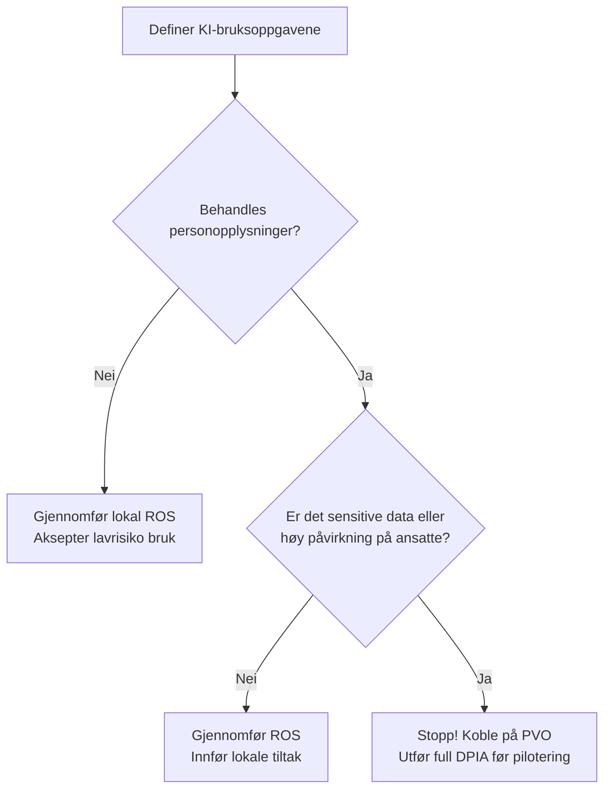

# Veiledning: Når ROS og når DPIA i HR Strategiradar?

> [!WARNING]
> **VEILEDNING FOR WORKSHOP-BRUK — UTKAST (IKKE EN ENDELIG JURIDISK VURDERING)**
> Dette dokumentet fungerer som en praktisk veileder for fasilitatorer, HR-rådgivere og prosjekteiere som bruker HR Strategiradar. Appen gir en foreløpig KI-diagnose, ikke et endelig resultat. Veiledningen gir råd om prosess, men erstatter ikke virksomhetens formelle rutiner for informasjonssikkerhet, personvern (GDPR) eller juridiske vurderinger.

I HR Strategiradar vurderer vi alltid en **konkret KI-bruksoppgave** (hva systemet faktisk skal gjøre) innenfor et HR-mikroprosjekt, i stedet for å vurdere hele prosjektet som én stor blokk. For å sikre forsvarlig bruk av kunstig intelligens må prosjektgruppen vite hvilke analyser som kreves, og når ekspertene må involveres.

---

## 1. Kort fortalt: Hva er forskjellen?

* **ROS (Risiko- og sårbarhetsanalyse):** Vurderer risiko for *virksomheten* og *oppgaven*. Den ser på informasjonssikkerhet, drift, organisatoriske sårbarheter, etikk, tillit og kildekvalitet. ROS er prosjektgruppens eget arbeidsverktøy for å sikre lokal forankring og tiltak.
* **DPIA (Personvernkonsekvensvurdering):** Vurderer risiko for *de berørtes* (ansatte eller søkeres) rettigheter, friheter og personvern under GDPR. En DPIA er lovpålagt ved høy risiko og krever at personvernombudet (PVO) rådføres.

---

## 2. Beslutningsmatrise: Hvilken vurdering trengs når?

| Brukssituasjon | Hva kreves? | Hvem involveres? |
|---|---|---|
| **Ingen personopplysninger** *(F.eks. idémyldring, skrive maler uten data, strukturere offentlig statistikk)* | **Grunnleggende ROS er nok** | Prosjektgruppen (leder, HR, tillitsvalgt) |
| **Alminnelige personopplysninger** *(F.eks. navn, e-post, stilling, standard turnusdata i lukket system)* | **ROS med personvernvurdering** | Prosjektgruppen. PVO kan informeres/rådføres ved behov. |
| **Sensitive opplysninger (GDPR art. 9)** *(F.eks. sykefraværshistorikk, helsedata, fagforeningsmedlemskap)* | **Full ROS + formell DPIA** | Prosjektgruppen, PVO og IT-sikkerhetsansvarlig. |
| **Høyrisiko i arbeidslivet (AI Act Annex III)** *(F.eks. rangering av søkere, profilering, automatisert oppgavefordeling)* | **ROS + DPIA + FRIA** *(Fundamentalrettighetsvurdering)* | Prosjektgruppen, PVO, jurist og ledergruppen. |

---

## 3. Når er en lokal ROS nok?

En lokal ROS-analyse (ved bruk av f.eks. [ROS-malen](file:///C:/Users/larse/Documents/ki-beslutningsradar/templates/ros/hr_strategiradar_ros_mal.md)) er tilstrekkelig dersom:
1. **Det er null personopplysninger:** Dataene som behandles er enten syntetiske, helt anonymiserte (uten mulighet for re-identifisering), eller består kun av generelle virksomhetsdata.
2. **KI-rollen er rent støttende:** Systemet brukes kun som **utforskende støtte** (f.eks. til å skrive utkast til en intervjuguide eller foreslå felles temaer for en workshop).
3. **Ingen direkte påvirkning:** Resultatet fra KI-oppgaven kan ikke føre til at en enkeltansatt eller jobbsøker får endret sine rettigheter, plikter eller arbeidsbetingelser.

---

## 4. Når MÅ en formell DPIA utredes?

Etter GDPR artikkel 35 er en DPIA (ved bruk av f.eks. [DPIA-malen](file:///C:/Users/larse/Documents/ki-beslutningsradar/templates/dpia/hr_strategiradar_dpia_mal.md)) **lovpålagt** dersom behandlingen av personopplysninger sannsynligvis vil medføre en *høy risiko* for de ansattes rettigheter og friheter.

I en HR-kontekst utløses dette kravet nesten alltid ved:
* **Behandling av særlige kategorier (sensitive data):** All bruk av helsedata, sykefraværshistorikk, fagforeningsmedlemskap eller biometrisk informasjon i et KI-system.
* **Systematisk overvåking eller kontroll:** Systemer som logger, overvåker eller analyserer ansattes prestasjoner, tidsbruk, lokasjon eller e-postaktivitet.
* **Profilering og automatiserte avgjørelser:** Dersom KI-systemet lager profiler av ansatte eller søkere som brukes til å ta avgjørelser om ansettelse, opprykk, tildeling av vakter eller oppsigelse.
* **Sårbare registrerte:** Ansatte står i et asymmetrisk maktforhold til arbeidsgiver. Dette gjør at Datatilsynet vurderer ansatte som en sårbar gruppe, noe som senker terskelen for når en DPIA kreves.

---

## 5. Når må Personvernombudet (PVO) og jurister involveres?

Prosjektgruppen må ikke forsøke å løse komplekse juridiske spørsmål alene i en workshop. Du **må** koble på PVO og virksomhetens jurister/sikkerhetsansvarlige i følgende situasjoner:

### 5.1 Koble på PVO (Personvernombudet):
* **Før oppstart av enhver DPIA:** PVO har en lovpålagt plikt til å gi råd under utarbeidelsen av en DPIA. PVO skal vurdere om risikoen er riktig kartlagt og om tiltakene er tilstrekkelige.
* **Ved usikkerhet om personopplysninger:** Dersom dere er i tvil om dataene dere bruker faktisk er anonyme (husk at indirekte gjenkjenning av personer i små datasett er en stor risiko).
* **Ved mistanke om uautorisert dataflyt:** Dersom det er uklart om KI-verktøyet sender data ut av virksomhetens lukkede sky eller lagrer data til modelltrening.

### 5.2 Koble på Jurist / Sikkerhetsansvarlig:
* **Ved avklaring av rettslig grunnlag:** Hvis det er tvil om virksomheten har lov til å samle inn eller bruke de aktuelle opplysningene til KI-formålet under GDPR artikkel 6 og 9.
* **Når EU AI Act slår inn:** Dersom KI-bruksoppgaven faller inn under ansettelse, rekruttering eller oppfølging av ansatte på en måte som kan kategoriseres som "høyrisiko". Jurister må da sikre at systemet oppfyller de strenge kravene til samsvarsvurdering (conformity assessment) og registrering.
* **Dersom rest-risikoen forblir HØY:** Hvis dere etter å ha planlagt alle tiltak i en DPIA konkluderer med at risikoen for de ansatte fortsatt er høy, **må** saken eskaleres. Virksomheten har da plikt til å forelegge saken for **Datatilsynet** for forhåndsdrøfting før systemet kan tas i bruk (GDPR art. 36).

---

## 6. Sjekkliste for fasilitatoren under workshop

Bruk denne enkle flyten når du leder en prosjektgruppe gjennom HR Strategiradar:

1. **Avgrens oppgaven:** Stopp diskusjonen hvis gruppen prøver å vurdere "KI i HR" generelt. Tving dem til å beskrive nøyaktig hva KI skal gjøre (f.eks. *"strukturere notater fra dialogmøte"*).
2. **Identifiser rådata:** Spør nøyaktig hva slags ord, tall og filer som skal mates inn. Ligger det helseinformasjon eller diagnoser der?
3. **Sjekk stoppreglene tidlig:** Hvis oppgaven gjelder individuell prioritering eller rangering, er dette en rød linje som utløser stoppregler. Foreslå en tryggere, mer aggregert eller utforskende tilnærming.
4. **Dokumenter menneskelig ansvar:** Sørg for at beslutningsnotatet beskriver den konkrete arbeidsmåten for human-in-the-loop (hvem verifiserer, hvem sjekker kilder, og hvem har det endelige lederansvaret).
