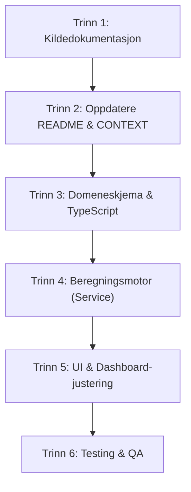

# Sprintplan: KI-kompass Alignment

Denne planen beskriver hvordan det oppdaterte rammeverket for **KI-kompasset** (fra `ki_kompasset_komprimert_md.zip`) skal integreres i hele repoet. Planen sikrer at all dokumentasjon, beregningsmotorer, datamodeller og brukergrensesnitt (UI) i **HR Strategiradar** samkjøres med den formelle teorien fra Berge & Knudsen.

---

## 🎯 Mål med sprinten
*   Etablere det nyoppdagede rammeverket som den kanoniske og offisielle kildeforståelsen i hele repoet.
*   Eliminere avvik mellom teori (Berge & Knudsen) og gjeldende implementering i applikasjonen (React/TypeScript-koden).
*   Oppdatere README, `CONTEXT.md` og andre veiledende filer.
*   Justere datamodeller og scoremotor til å bruke de fire offisielle kvadrantene/rollene og de nøyaktige stoppreglene.

---

## 🗺️ Oversikt over oppdagede gap

Ved gjennomgang av repoet og kildekoden i `apps/hr-strategiradar/` har vi identifisert følgende gap mellom nåværende implementering og det nye rammeverket:

1.  **KI-roller (Enums)**:
    *   *Nåværende kode*: Bruker `'utforskende_støtte'`, `'forsterket_skjønn'`, `'delautomatisering'` og `'automatisert_beslutning'`.
    *   *Nytt rammeverk*: Definerer de fire offisielle kvadrantrollene som:
        1.  `forsterket_skjonn` (Forsterket skjønn)
        2.  `automatisert_beslutning` (Automatisert beslutning)
        3.  `utforskende_stotte` (Utforskende støtte)
        4.  `strategisk_autonomi` (Strategisk autonomi)
    *   *Tiltak*: Erstatte `delautomatisering` med `strategisk_autonomi` i enums og UI, eller redefinere oversettelsene slik at de stemmer med de offisielle rollene.
2.  **Målklarhet & Separabilitet**:
    *   *Nåværende kode*: Beregner en sammensatt score for kompasset og blander inn kontrollkrav i beregningen av tillatt rolle.
    *   *Nytt rammeverk*: Holder målklarhet og separabilitet som helt uavhengige akser, der lav separabilitet automatisk krever menneskelig skjønn (Forsterket skjønn eller Utforskende støtte).
3.  **Terminologi**:
    *   *Nåværende kode*: Bruker begreper som "compliance-score" (`calculateComplianceScore`) og merkelappen "sikkerhetsmarginer".
    *   *Nytt rammeverk*: Fokuserer på "samsvarsgrad" og "kvalitetsport" for å unngå illusorisk compliance-tro.

---

## 📋 Trinnvis gjennomføringsplan

### Trinn 1: Dokumentere kildegrunnlaget formelt 📂
*   **Mål**: Sikre at kildenotatene er trygt forankret i repoet.
*   **Handling**:
    *   Vi har allerede plassert den utpakkede pakken under `archive/source_packages/ki_kompasset_komprimert_md/`.
    *   Opprette en ny permanent ressursfil `docs/architecture/adr_004_ki_kompass_alignment.md` som formelt beskriver arkitekturbeslutningen om å samkjøre med Berge & Knudsen.

### Trinn 2: Oppdatere README, `CONTEXT.md` og `CLAUDE.md` 📝
*   **Mål**: Gjøre det nye rammeverket synlig for alle utviklere og agenter.
*   **Handling**:
    *   **`README.md`**: Oppdatere leserekkefølgen og referere to `archive/source_packages/ki_kompasset_komprimert_md/` og `docs/architecture/adr_004_ki_kompass_alignment.md`.
    *   **`CONTEXT.md`**: Redefinere de fire offisielle KI-rollene og fjerne utdaterte referanser til "delautomatisering". Tydeliggjøre at kompasset er en *kvalitetsport* og ikke en automatisk compliance-motor.
    *   **`CLAUDE.md`**: Oppdatere prosjektets retningslinjer for hvordan beregninger skal gjøres og hvilke datafiler som er kanoniske.

### Trinn 3: Domeneskjemaer og TypeScript-typer ⚙️
*   **Mål**: Sørge for at datamodellen reflekterer det nye rammeverket.
*   **Handling**:
    *   Oppdatere `apps/hr-strategiradar/src/domain/schemas.ts` (eller tilsvarende type-filer).
    *   Endre enums for KI-roller til å inkludere `strategisk_autonomi` og fjerne `delautomatisering`.
    *   Tilpasse datafixtures i `apps/hr-strategiradar/src/fixtures/` slik at de pre-scorede casene samsvarer med de offisielle rollene.

### Trinn 4: Oppdatere Beregningsmotoren 🧮
*   **Mål**: Sørge for at beregningen av anbefalt KI-rolle og stoppregler følger den nye modellen nøyaktig.
*   **Handling**:
    *   Oppdatere `apps/hr-strategiradar/src/services/mockDiagnosisService.ts`.
    *   Redefinere `ROLE_LABELS` og `getCalculatedRole` til å beregne kvadrantene basert på ren målklarhet og separabilitet (Y- og X-akser).
    *   Sikre at stoppreglene (SR-01 til SR-08) blokkerer overgang til høyere autonomi, spesielt når separabiliteten er lav (standardantakelsen i HR/HMS).

### Trinn 5: Justere UI-komponenter og Dashboard 🖥️
*   **Mål**: Vise de offisielle rollene og kvadrantene vakkert i brukergrensesnittet.
*   **Handling**:
    *   Oppdatere `apps/hr-strategiradar/src/components/Dashboard/CompassView.tsx`.
    *   Justere visualiseringen av de fire kvadrantene i diagrammet (kartet på Y- og X-aksen).
    *   Sikre at "Beslutningslogg"-visningen krever utfylling av den menneskelige vurderingen før lukking.

### Trinn 6: Testing, verifisering og regresjon 🧪
*   **Mål**: Garantere at alt fungerer og at ingen eksisterende funksjonalitet brytes.
*   **Handling**:
    *   Kjøre eksisterende tester (`npm run test` eller `vitest`).
    *   Oppdatere enhetstester for å matche de nye rollene og beregningsverdiene.
    *   Verifisere mot `evals/` for å sikre at regressjonskravene er 100 % oppfylt.

---

## 📅 Tidsplan og Sprintinndeling

Vi foreslår å dele dette opp i to tette iterasjoner:

1.  **Iterasjon 1 (Dokumentasjon og Forberedelse)**:
    *   Oppdatering av README, `CONTEXT.md` og `CLAUDE.md`.
    *   Opprettelse av ADR (Architectural Decision Record).
    *   *Estimat*: 1 time.
2.  **Iterasjon 2 (Kodebase-alignment og UI)**:
    *   TypeScript-endringer, kildedata (fixtures), beregningslogikk og enhetstester.
    *   UI-oppdateringer og visuell verifisering.
    *   *Estimat*: 2 timer.
