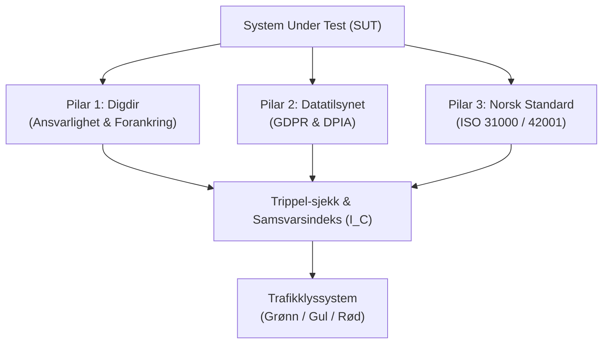
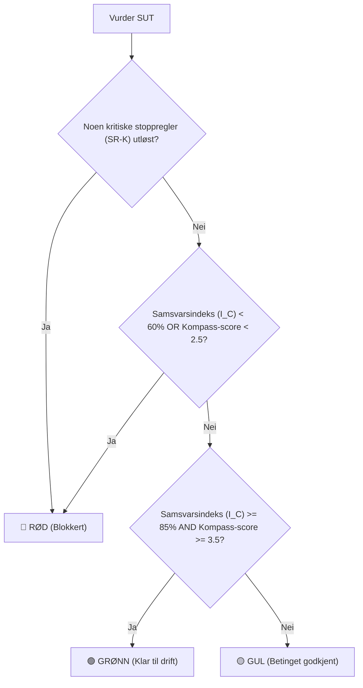

# Vektingsmodeller og Standardbasert Risikovurdering for KI-beslutningsradar

## 1. Innledning og formål

Formålet med denne rapporten er å etablere et robust, transparent og standardbasert rammeverk for risikovurdering av et **System Under Test (SUT)** i *KI-beslutningsradaren*. Den nåværende modellen i applikasjonsspesifikasjonen benytter en rent lineær 45/55-vekting mellom *Målklarhet* og *Separabilitet* for å beregne en kompass-score. Denne lineære tilnærmingen har betydelige svakheter, særlig fordi den tillater at en svært høy score på den ene aksen kompenserer for en kritisk lav score på den andre (såkalt kompensatorisk vekting).

For å sikre at beslutningsradaren kan brukes som et pålitelig styringsverktøy i både offentlig og privat sektor, foreslår denne rapporten to vesentlige oppgraderinger:
1. **En ny matematisk/logisk kompassmodell (GMM - Geometrisk-Min-Modell)** som er ikke-kompensatorisk, mer robust og som straffer ubalanse (polarisering) mellom målklarhet og separabilitet.
2. **Et strukturert og intuitivt trafikklyssystem (Rød, Gul, Grønn) for SUT** som utfører en "trippel-sjekk" mot harmoniserte retningslinjer fra **Digdir**, **Datatilsynet** og **Norsk Standard (ISO 31000 og ISO/IEC 42001)**.

Modellen er designet for å bevare det grunnleggende skillet mellom arkitekturens ulike lag i henhold til prosjektets kjerneregler (AGENTS.md): *kart*, *kompass*, *kontrollkrav*, *linser* og *beslutningslogg* holdes strengt adskilt.

---

## 2. Research-grunnlag: De tre pilarene

For å bygge et helhetlig vurderingssystem må vi hente de beste praksisene fra nasjonale myndigheter og internasjonale standardiseringsorganer.



### Pilar 1: Digdir (Digitaliseringsdirektoratet)
Digdirs veiledning for bruk av kunstig intelligens i offentlig sektor fokuserer sterkt på etisk, transparent og ansvarlig bruk. Deres retningslinjer krever at offentlige virksomheter sikrer:
*   **Lokal forankring og ROS-analyse:** Hvert KI-tiltak må ha en tydelig forankret eier og en lokal Risiko- og sårbarhetsanalyse (ROS) som tar hensyn til lokale nyanser.
*   **Menneskelig overoppsyn (Human-in-the-loop):** Algoritmen skal aldri fatte endelige beslutninger alene i saker som påvirker innbyggernes rettigheter eller plikter. Saksbehandleren må ha reell mulighet til å forstå, verifisere og overstyre modellens utdata for å motvirke blind tillit (*automation bias*).
*   **Transparens og åpenhet:** Det skal være klart merket og lett forståelig for brukerne når de samhandler med eller mottar vedtak påvirket av et KI-system.
*   **Partsmedvirkning:** Ansattes representanter, tillitsvalgte og verneombud skal involveres tidlig i prosessen for å sikre medvirkning og hindre utilsiktet bias eller uheldige arbeidsforhold.

### Pilar 2: Datatilsynet (Personvern & DPIA)
Datatilsynets praksis og veiledere for kunstig intelligens og personvern (inkludert lærdommer fra deres regulatoriske sandkasse) stiller strenge krav under GDPR:
*   **Rettslig grunnlag og dataminimering (GDPR Art. 5 og 6):** Behandlingen av personopplysninger må ha et gyldig rettslig grunnlag. Data som mates inn i modellen må begrenses til det som er strengt nødvendig for formålet.
*   **Databehandleravtale (DPA) og lukkede miljøer:** Sensitive eller virksomhetskritiske data må aldri mates inn i åpne, kommersielle KI-modeller. Det kreves et lukket miljø understøttet av en juridisk bindende og signert databehandleravtale (DPA) som garanterer at leverandøren ikke bruker dataene til egen modelltrening.
*   **Personvernkonsekvensvurdering (DPIA - GDPR Art. 35):** Bruk av KI på personopplysninger innebærer nesten alltid "høy risiko" på grunn av teknologiens uforutsigbarhet, "svart boks"-problematikk og profilering. Dette utløser et ufravikelig krav om en formell DPIA før systemet tas i bruk.
*   **Registredes rettigheter:** Systemet må designes slik at det er praktisk mulig å oppfylle retten til innsyn, retting og sletting ("retten til å bli glemt"), noe som er en kjent teknisk utfordring i dype læringsmodeller.

### Pilar 3: Norsk Standard (NS-ISO 31000 & NS-ISO/IEC 42001)
Norsk Standard leverer de formelle strukturelle rammeverkene for risikostyring og KI-styringssystemer (*AIMS - Artificial Intelligence Management System*):
*   **NS-ISO 31000 (Risikostyring):** Etablerer en kontinuerlig og iterativ prosess (identifisere, analysere, evaluere, behandle og overvåke risiko). Risikovurdering er ikke en engangsjobb, men en løpende aktivitet gjennom hele systemets livssyklus.
*   **NS-ISO/IEC 42001 (Styringssystem for KI):** Den første internasjonale sertifiserbare standarden for KI-styring. Den krever dokumentert kontroll over hele livssyklusen til et KI-system. Sentrale krav inkluderer:
    *   *Robusthet og modellkvalitet:* Løpende overvåking for å oppdage modellavvik (*drift*) over tid.
    *   *Bias-monitorering:* Etablering av systematiske kontroller for å detektere og forhindre diskriminering og urettferdige utfall.
    *   *Sporbar logging:* Automatisk og sikker logging av systemets beslutningsbaner for å muliggjøre revisjon og etterprøving.
    *   *Fundamentalrettighetsvurdering (FRIA):* Vurdering av KI-systemets innvirkning på grunnleggende menneskerettigheter, særlig aktuelt under EUs KI-forordning (EU AI Act).

---

## 3. Analyse av eksisterende "Offentlig KI-standard"

Den eksisterende filen `data/virksomhetskrav/offentlig_ki_standard.md` gir et solid fundament bygget på beste praksis fra Digdir, NAV, Oslo kommune og Trondheim kommune.

Standarden definerer **4 kjerneområder for etterlevelse**:
1.  **Lokal forankring og ROS-analyse** (Digdir-fokus)
2.  **Lukket og godkjent verktøy med DPA** (Datatilsynet-fokus)
3.  **Menneskelig overoppsyn og kildekritikk (Human-in-the-loop)** (Digdir-fokus)
4.  **Transparens og partsmedvirkning** (Digdir/ISO-fokus)

Videre definerer den **dynamiske risikoutløsere**:
*   *Behandling av sensitive personopplysninger (GDPR art. 35):* Utløser umiddelbart krav om formell DPIA.
*   *Høyrisiko-systemer (EU AI Act):* Utløser krav om FRIA, sporbar automatisk logging, samsvarsvurdering og løpende overvåking mot diskriminering (ISO 42001-fokus).

**Konklusjon fra analysen:**
Den eksisterende standarden er høyst operasjonell, men mangler en bro over til beregningsmotoren i beslutningsradaren. De kvalitative kravene må oversettes til en kvantifiserbar og logisk struktur som kan brukes direkte til å klassifisere et SUT i et trafikklyssystem, samt sette absolutte grenser (*rolle-tak*) for KI-systemet.

---

## 4. Den nye kompassmodellen: Geometrisk-Min-Modell (GMM)

### Svakheter ved dagens modell
Dagens lineære formel:
$$K_{gammel} = M \times 0.45 + S \times 0.55$$

Dette skaper en ubalansert og potensielt farlig situasjon. Hvis et KI-system for eksempel har ekstremt høy målklarhet ($M = 5.0$, f.eks. "beregne pensjonsutbetaling ut fra historiske data"), men ekstremt lav separabilitet ($S = 1.0$, fordi det berører sensitive livssituasjoner, krever dyp tillit, og lokale unntak forekommer hyppig), vil den gamle formelen gi:
$$K_{gammel} = 5 \times 0.45 + 1 \times 0.55 = 2.25 + 0.55 = 2.80$$

En score på $2.80$ plasserer systemet i kategorien **forsterket skjønn** eller **utforskende støtte**, noe som skjuler det faktum at separabiliteten er kritisk lav ($1.0$). Det lineære snittet tillater at den tekniske målklarheten "maskerer" at oppgaven er fundamentalt uegnet for frakoblet KI-drift.

### Den nye formelen: GMM med polariseringsstraff
For å løse dette foreslår vi den **Harmoniserte Geometrisk-Min-Modellen (GMM)**:

$$K_{score} = \sqrt{M \times S} \times \left(1 - \frac{|M - S|}{10}\right)$$

Modellen består av to komponenter:
1.  **Den geometriske middelverdien ($\sqrt{M \times S}$):** Fungerer som en ikke-kompensatorisk buffer. Hvis én av scorene faller mot null, faller den samlede scoren drastisk raskere enn ved et aritmetisk eller lineært snitt.
2.  **Polariseringsstraffen ($1 - \frac{|M - S|}{10}$):** Straffer avviket (differansen) mellom de to aksene. Dersom det er stor avstand mellom målklarhet og separabilitet, representerer dette en systemisk risiko (f.eks. at vi har et teknisk perfekt verktøy, men ingen organisatorisk mulighet til å bruke det trygt uten mennesker til stede). Denne straffen reduserer scoren ytterligere.

### Scenario-sammenligning (Gammel vs. Ny)

For å demonstrere robustheten sammenligner vi fire typiske scenarioer (skala 1-5):

| Scenario | Målklarhet ($M$) | Separabilitet ($S$) | Gammel lineær score (45/55) | Ny GMM-score | Evaluering av ny modell |
| :--- | :---: | :---: | :---: | :---: | :--- |
| **A: Perfekt balanse (Høy)** | 5.0 | 5.0 | 5.00 | **5.00** | Bevarer maksimal verdi ved fullstendig modenhet. |
| **B: Moderat balanse** | 3.5 | 3.5 | 3.50 | **3.50** | Bevarer verdien når aksene er i harmoni. |
| **C: Kritisk ubalanse (M=5, S=1)** | 5.0 | 1.0 | 2.80 | **1.34** | **Ekstremt robust.** Tvinger et system med kritisk lav separabilitet ned i rød sone (uegnet), i stedet for å la målklarheten maskere risikoen. |
| **D: Kritisk ubalanse (M=1, S=5)** | 1.0 | 5.0 | 3.20 | **1.34** | **Trygg.** Hindrer at høy separabilitet (f.eks. en enkel teknisk integrasjon) tillater automatisering av en oppgave som mangler ethvert klart mål. |
| **E: Moderat ubalanse (M=4, S=2)** | 4.0 | 2.0 | 2.90 | **2.26** | Korrigerer scoren nedover til rød/lav gul randsone på grunn av ubalansen på 2 poeng. |

Denne modellen er matematisk elegant, fullstendig forklarbar for revisorer, og krever ingen vilkårlige desimalvektinger som $0.45$ eller $0.55$. Den speiler det virkelige risikobildet: **Et KI-system er aldri tryggere enn sin svakeste dimensjon.**

---

## 5. Trippelsjekk-indeks ($I_C$) for SUT

For å etablere en transparent samsvarsvurdering definerer vi en **Trippelsjekk-indeks ($I_C$)**. Denne består av 12 konkrete indikatorer fordelt på de tre pilarene. Hver indikator skåres fra 0 til 2:
*   **0 (Mangler):** Kravet er ikke oppfylt eller dokumentert.
*   **1 (Delvis):** Kravet er delvis oppfylt, under arbeid, eller har mindre mangler.
*   **2 (Fullt ut):** Kravet er fullt ut oppfylt, dokumentert og verifisert.

```text
Samsvarsindeks (I_C) = (Sum av alle 12 indikatorskårer / 24) * 100
```

### Indikator-matrise

| Pilar | ID | Indikator | Beskrivelse og verifikasjonsmetode |
| :--- | :---: | :--- | :--- |
| **Digdir** | **D1** | Lokal ROS-analyse | Foreligger det en signert og arkivert Risiko- og sårbarhetsanalyse (ROS) spesifikt for denne KI-bruksoppgaven? |
| | **D2** | Menneskelig overstyring | Har saksbehandleren et klart definert og teknisk tilrettelagt "Human-in-the-loop"-grensesnitt for å avvise/endre modellens output? |
| | **D3** | Transparens og merking | Blir det opplyst tydelig til sluttbruker/innbygger når KI er benyttet som beslutningsstøtte? |
| | **D4** | Partsmedvirkning | Er tillitsvalgte og verneombud formelt involvert og har godkjent innføringsløpet? |
| **Datatilsynet** | **P1** | Rettslig grunnlag | Er det dokumentert et gyldig rettslig grunnlag etter GDPR Art. 6 (og ev. Art. 9 for særlige kategorier)? |
| | **P2** | Lukket system & DPA | Er systemet kjørt i lukket instans, og foreligger det en gyldig Databehandleravtale (DPA) som forbyr leverandørtrening på dataene? |
| | **P3** | DPIA-status | Er en formell personvernkonsekvensvurdering (DPIA) gjennomført og godkjent av personvernombudet (PVO) (eller forenklet vurdering dersom ingen sensitive data behandles)? |
| | **P4** | Registredes rettigheter | Finnes det etablerte rutiner og teknisk evne til å slette, eksportere eller korrigere personopplysninger i systemets dataflyt? |
| **Norsk Standard** | **S1** | Livssyklus risikostyring | Er risikovurderingen satt i system i tråd med ISO 31000, med faste intervaller for gjennomgang? |
| | **S2** | Sporbar logging | Logger systemet automatisk alle KI-genererte anbefalinger, samt saksbehandlers eventuelle endringer og begrunnelser for overstyring? |
| | **S3** | Bias-overvåking | Er det etablert rutiner for å teste og overvåke systemet mot urettferdig forskjellsbehandling (bias) av ulike grupper? |
| | **S4** | Modellkvalitet og drift | Overvåkes modellens nøyaktighet og stabilitet over tid for å fange opp konseptuell degradering (drift)? |

---

## 6. Kritiske Stoppregler (SR-K)

Selv om et system oppnår en god gjennomsnittlig score, må visse fundamentale brudd føre to umiddelbar stans. Vi definerer fire **Kritiske Stoppregler (SR-K)** direkte knyttet til standardene:

> [!CAUTION]
> **SR-K1 (Menneskelig kontroll - Digdir/EU AI Act):**
> Utløses dersom KI-systemet utfører oppgaver med direkte påvirkning på enkeltpersoners rettigheter, arbeid eller HMS, uten at det finnes et reelt og fungerende menneskelig ledd (*Human-in-the-loop*) som verifiserer og godkjenner resultatet.

> [!CAUTION]
> **SR-K2 (Datadeling - Datatilsynet/GDPR Art. 28):**
> Utløses dersom sensitive personopplysninger (GDPR Art. 9/10) eller konfidensielle virksomhetsdata mates inn i et åpent, kommersielt verktøy uten en signert og gyldig Databehandleravtale (DPA).

> [!CAUTION]
> **SR-K3 (Lovpålagt DPIA - Datatilsynet/GDPR Art. 35):**
> Utløses dersom behandlingen involverer sensitive personopplysninger eller storskala profilering, og det *ikke* foreligger en formell, godkjent Personvernkonsekvensvurdering (DPIA).

> [!CAUTION]
> **SR-K4 (Sikkerhet og sporbarhet - ISO/IEC 42001):**
> Utløses dersom et høyrisiko KI-system (som påvirker ansettelse, HMS eller rettigheter) driftes uten sporbar automatisk logging av beslutningsbaner, eller uten mulighet for revisjon.

---

## 7. Det endelige Trafikklyssystemet for SUT

Når vi kombinerer **Samsvarsindeksen ($I_C$)**, den nye **Kompass-scoren ($K_{score}$)** og de **Kritiske Stoppreglene (SR-K)**, får vi et helhetlig trafikklyssystem for klassifisering av SUT.

### Terskelverdier og beslutningslogikk



| Status | Kriterier (Logisk formel) | Konsekvens for SUT | Strategisk implikasjon i radaren |
| :--- | :--- | :--- | :--- |
| **🟢 GRØNN**<br>(Klar til drift) | $I_C \ge 85\%$ **OG** ingen SR-K utløst **OG** $K_{score} \ge 3.5$ | SUT er fullt ut godkjent for den tiltenkte rollen. Det er høy grad av samsvar med alle tre standarder, og systemets egnethet er dokumentert balansert og robust. | Løsningen kan rulles ut i tråd med beregnet KI-rolle (inkludert automatisert beslutning dersom $K_{score} \ge 4.3$ og kontrollscore er tilstrekkelig). |
| **🟡 GUL**<br>(Betinget godkjent) | $60\% \le I_C < 85\%$ **OG** ingen SR-K utløst **OG** $2.5 \le K_{score} < 3.5$ | SUT godkjennes kun med særskilte vilkår. Det foreligger moderate mangler i dokumentasjon eller rutiner (f.eks. manglende bias-testing eller behov for tettere manuell oppfølging). | Systemet er begrenset til **maksimalt** *forsterket skjønn* eller *utforskende støtte*. Det må settes en tidsbegrenset godkjenning (f.eks. 6 måneder) og lages en handlingsplan for å lukke avvikene. |
| **🔴 RØD**<br>(Blokkert / Avvist) | $I_C < 60\%$ **ELLER** minst én SR-K utløst **ELLER** $K_{score} < 2.5$ | SUT har kritiske mangler, uakseptabel risiko, eller er fundamentalt uegnet for KI-støtte. Systemet utgjør en sikkerhets-, personvern- eller omdømmerisiko. | **Fullstendig blokkert for bruk.** Systemet må redesignes, flyttes til en lukket infrastruktur, eller underlegges streng manuell styring. Ny ROS-analyse og evaluering kreves før eventuell re-testing. |

---

## 8. Arkitektoniske prinsipper for implementering

For å sikre at dette konseptet kan implementeres uten å bryte prosjektreglene (AGENTS.md), må vi respektere lagdelingen:

1.  **Kartet (The Map):** Samler kontekstdata (virksomhetsmål, berørte parter, oppgavetype). Kartet *påvirker ikke* kompass-scoren direkte, men danner grunnlaget for å identifisere hvilke sjekkpunkter i Trippelsjekken som er relevante (f.eks. om personopplysninger i det hele tatt behandles).
2.  **Kompasset (The Compass):** Beregner utelukkende systemets iboende egnethet basert på dimensjonene Målklarhet ($M$) og Separabilitet ($S$) gjennom den nye **GMM-formelen**. Kompasset skal *aldri* blande inn forklarbarhet eller personvern som akser – disse holdes som eksterne krav.
3.  **Kontrollkravene (Control Requirements):** Vurderer faktorer som *Forklarbarhet & Menneskelig overoppsyn* og *Anti-overreliance*. Disse brukes til å justere den endelige godkjenningen, men endrer ikke selve kompass-plasseringen.
4.  **Linser (Lenses):** Spesifikke filtre (som HR-linse eller Offentlig sektor-linse) som kan belyse saken fra ulike fagperspektiver. Linser er ikke dimensjoner, men rapporteringslag.
5.  **Beslutningsloggen (Decision Log):** Det endelige verifikasjonsdokumentet som samler SUT-status, kompass-plassering, samsvarsindeks og lederens signatur. Dette danner virksomhetens dokumentasjon i tråd med ISO 42001 og forvaltningsloven.

Ved å implementere denne modellen i neste byggefase vil *KI-beslutningsradaren* gå fra å være et enkelt skåringsverktøy til å bli et fullverdig, profesjonelt styringssystem som tåler granskning fra både Datatilsynet, revisorer og tillitsvalgte.
